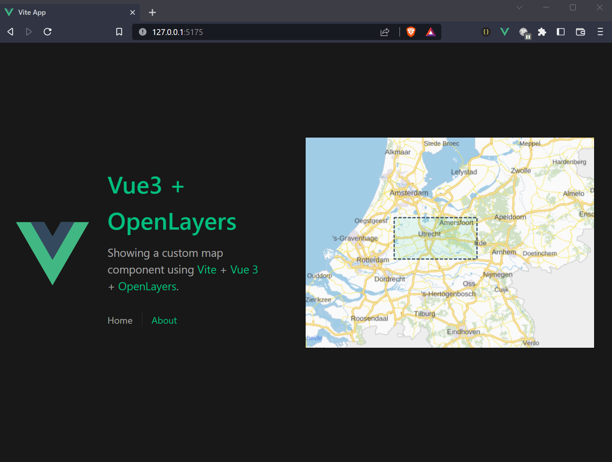

# OpenLayers sample app

This is an example Vue app that uses OpenLayers. The `HomeView` renders a `TheMap` component to which I pass a geometry json.

## Creation

```sh
npm init vue@latest
cd vue-project
npm install --save ol prettier
npm install
npm run format
```

## How to run

```sh
npm run dev
open http://127.0.0.1:5175/
```

## Demo


